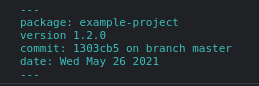
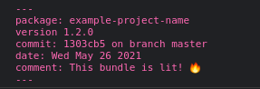

# Webpack Plugin Log Version
A simple plugin for logging your project build version into the browser console. The purpose of the plugin is to help keep track of which version of a bundle is deployed where. This may be useful if you deploy different versions of a project in many places.

**Note**: This plugin is beta software. Please report bugs and contribute suggestions.

<!-- MarkdownTOC autolink="true" autoanchor="true" levels="1,2,3" -->

- [Requirements](#requirements)
- [Usage](#usage)
    - [Configuration](#configuration)
- [Examples](#examples)
- [Getting Help & Contributing](#getting-help--contributing)

<!-- /MarkdownTOC -->

<a id="requirements"></a>
## Requirements
1. Webpack version 5 or greater
2. Git (if using git features)

<a id="usage"></a>
## Usage
This guide assumes you already know how to setup a webpack configuration.

1. First, install the plugin `npm install -D webpack-plugin-log-version`
2. Import the plugin and add it to your config:
    ```javascript
    const LogVersionPlugin = require('webpack-plugin-log-version')

    module.exports = {
      entry: './src/js/index.js',
      output: {
        filename: 'bundle.js',
        path: path.resolve(__dirname, 'dist') 
      },
      module: {
        rules: [
          { 
            test: /\.js$/,
            exclude: /(node_modules)/,
            use: {
              loader: 'babel-loader',
              options: {
                presets: ['@babel/preset-env']
              }
            },
          }
        ]
      },
      plugins: [
        new LogVersionPlugin()
      ]
    }
    ```
3. Run a build of your project and load it in your browser. You should see an output log with the default settings:

    

<a id="configuration"></a>
### Configuration

You may pass in a configuration object into the plugin to customize the output.

The configuration options and their defaults are as follows:
```typescript
declare type PluginOptions = {
  color: string
  comment: string
  git: boolean
  global: boolean
  globalName?: string
  log: boolean
  name?: string
  template?: string
}
```
* `color`: Choose a different color for the console.log output. Can be any browser console compatible keyword or HEX value.
* `comment`: Add an optional comment to the end of your log
* `git`: Enable git features and the project's branch and commit to the log Default: `true`
*  `global`: Add an object to the global (window) context that contains the log information. Default: `false`
* `globalName`: change the key for the `global` object. Default: `package.name`
* `log`: Enable logging the version information in the console: Default: `true`
* `name`: Override the default project name for the version log. Default: `package.name`
* `template`: Override the `console.log` template for the version information. Uses [EJS](https://ejs.co/). Default: [See Source](./src/templates/default.ejs)

<a id="template-variables"></a>
#### Template Variables
The plugin uses the following variables if they exist in the template already:

* `branch`: working directory branch
* `color`: log color
* `comment`: the optional comment
* `commit`: the latest commit (HEAD)
* `date`: today's date
* `name`: project name
* `version`: project version

You may change up the template or re-arrange the output as you see fit with the plugin's `template` option.

<a id="examples"></a>
## Examples

1. Omit the console log, but add an object to the window global. Give it an easier name to type:
    ```javascript
    new LogVersionPlugin({
        log: false,
        global: true,
        globalName: 'myAwesomeLog'
    })
    ```
    This will generate: `window.myAwesomeLog = {name: package.name, version: package.version, ...etc}` and prevent logging the version out loud in the console
2. Override the default template with a simpler log:
    ```javascript
    new LogVersionPlugin({
        git: false,
        name: 'Example Bundle',
        template: '<%= name %> - <%= version %> - <%= date %>'
    })
    ```
    Output: `Example Bundle - 1.2.0 - Wed May 26 2021`
3. Display the version information in hot pink & add a comment to it
    ```javascript
    new LogVersionPlugin({
        color: 'hotpink',
        comment: "This bundle is lit! 🔥"
    })
    ```
    

<a id="getting-help--contributing"></a>
## Getting Help & Contributing

Please leave an issue and explain the problem. Be as detailed as possible. If you wish to contribute feel free to submit pull requests and issues with your features and requests.

If you wish to contribute pull requests, please use the contrib branch